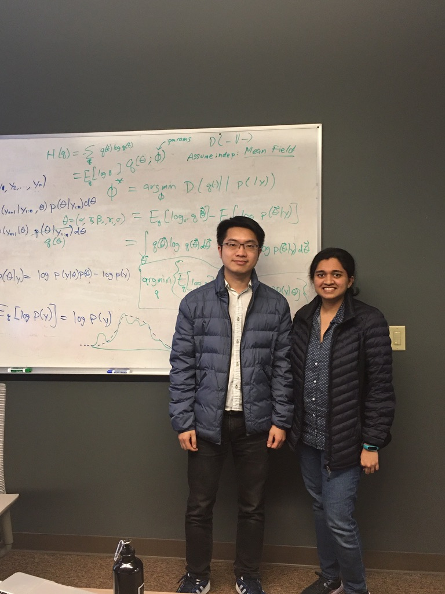

## Start from Hong Kong: 199X - 2019
Yoooo! I am Geoffrey from Hong Kong, currently in California! I graduated with my BSc in Statistics from [CUHK](https://www.cuhk.edu.hk/), the place that I am proud of <3.

I worked in various companies in Hong Kong! I am glad to meet a lot of great leaders & colleagues and learn from them.

## Move to SF Bay Area: 2019 - Now
In 2019, I moved to the Bay Area to attend the University of San Francisco's [MSDS](https://www.usfca.edu/arts-sciences/graduate-programs/data-science). I enjoy the environment [maybe not the downtown :( ] and all the great people I have met in the Bay Area! Sadly, I cannot experience the "normal" social life because of COVID :(

from time to time, I have some random walks around the Bay side, walk, sit and think

## MSDS and Manifold: 2019 - 2020
I am fortunate enough to do my practium at [Manifold AI](https://manifold.ai/) and work on some [open-ended research](https://en.wikipedia.org/wiki/System_identification) using deep learning with world class tech-leaders and hardcore engineers. This experience also changes my understandings in ML/DS and engineering in general!

## Interests
My interests are DS and engineering in general, I am particularly interested in ML/DS workflow. I honor the [Three Virtues](http://threevirtues.com/) of a programmer and love to bring those virtues to ML/DS world!

Outside work and study, I have started to pick up cooking skills since 2020 [because of COVID]. I have also spent some times on Brawl Stars [hit me by #C2QRU8QQ]. Reading is also a big component of my life, I enjoy history and psychology most! I will probably include some books that impact me the most in a section of this site

## For this site
I don't think I will take aggressive approach [aka job searching] for this blog. Afterall I see there are so many blogs without updates for years after the authors found the job LOL I don't want to be one of them and hope to sustain this blog longer. I will probably treat this as my private space and library to keep track of my thoughts and learnings.

Depending on materials, maybe I will use Chinese 中文 some times